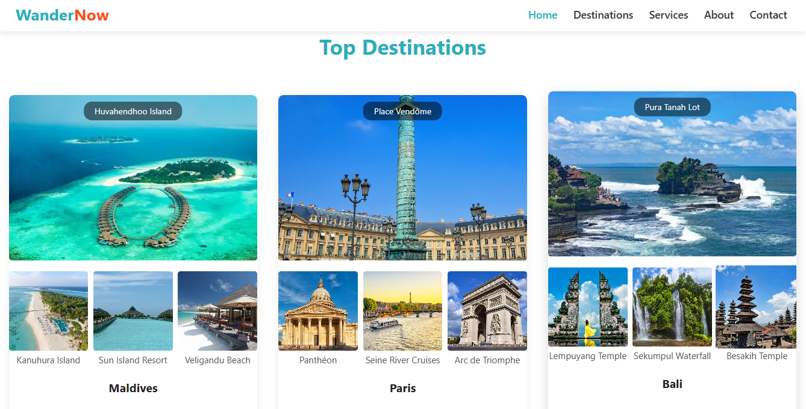
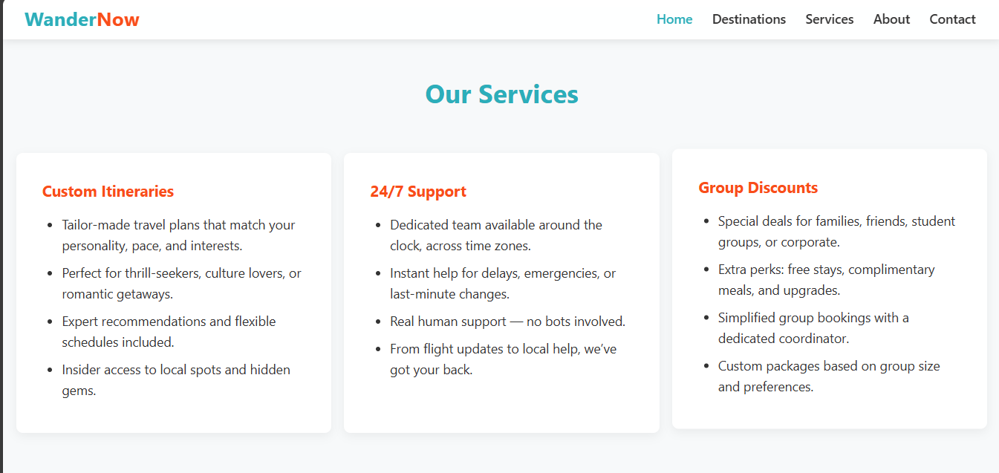
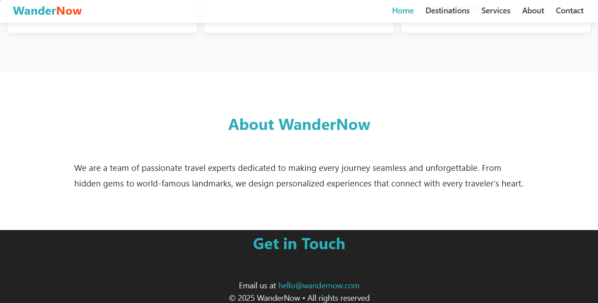

# Responsive Landing Page for Travel Appealing

This project is a **responsive landing page** designed specifically for travel and tourism websites. It features an attractive, modern layout that adapts seamlessly to all devices, making it perfect for engaging visitors and showcasing travel destinations.

## ✨ Features

- Fully responsive design for mobile, tablet, and desktop
- Visually appealing sections for destinations, offers, and testimonials
- Smooth navigation and user-friendly interface
- Clean and well-organized code for easy customization

## 🚀 Getting Started

1. Clone the repository:
   ```bash
   git clone https://github.com/Arvind-Giri01/CODECRAFT_WD_01.git
   ```
2. Open the `index.html` file in your browser to view the landing page.

## 🛠️ Technologies Used

- HTML5
- CSS3
- JavaScript.

## Preview 


- ### Home Page
  


- ### Destination Page
  




- ### Service Page
  




- ### About and Contact Page
  




